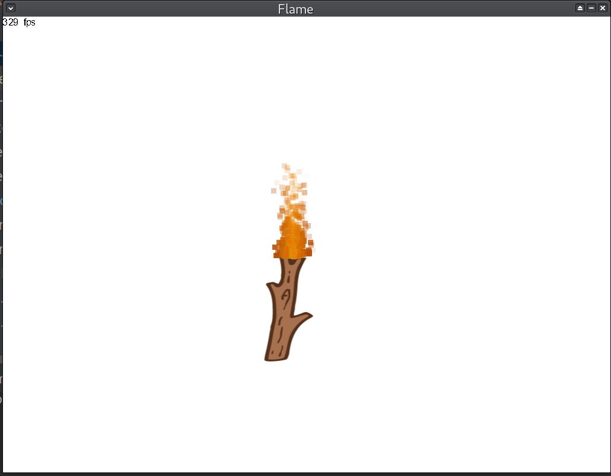

# A Flame Simulation made by SDL2

A flame simulation made with particle, and left click to simulate wind effect.

## dependence
 + SDL2
 + SDL2_ttf

## build
 + cmake CMakeLists.txt
 + make

## run
 + ./flame

note: when build on windows, you must add font path at main.cpp line 36, otherwise the program will not run.